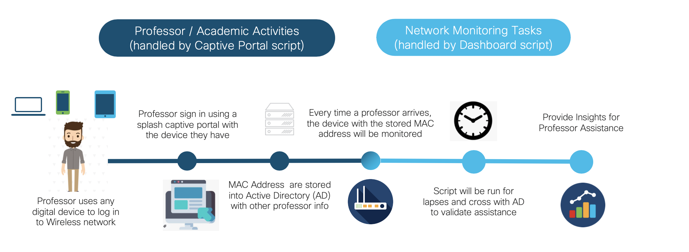
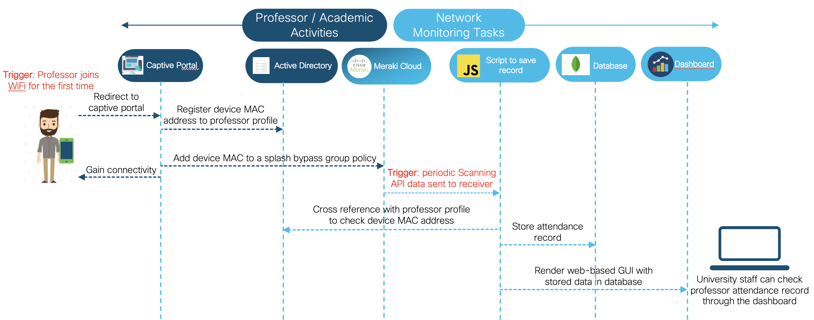

# Meraki Measure Assistance for University

A solution to take attendance by scanning devices, recognising owner with data stored in Active Directory, through Meraki devices.

---

This solution consists of two parts: Captive Portal & Web-based Dashboard. The following diagram describes the high-level workflow.



**Captive Portal**: When a professor connects to the University WiFi for the first time, a captive portal will prompt and ask for name and email. The information will be passed and checked with Active Directory. If it is validated as a professor, the MAC address will be added to a splash page bypass policy so that the professor does not need to visit the captive portal when connects to the University WiFi in the future. The MAC address will also be added into Active Directory under the professor's profile, which will be useful in monitoring.

**Dashboard**: The dashboard will act as a Meraki Scanning API receiver, and provide web interface to display professors' attendance. Meraki Scanning API is enabled and will send a POST request to the dashboard with details of nearby devices as payload. The dashboard will cross reference the scanning data with Active Directory, and log the attendance of professor if it exists to MongoDB. In the web interface, the professor attendance data stored in MongoDB is tabulated, with options to trace back in time, shown by daily or weekly.



## Contacts
* Alvin Lau (alvlau@cisco.com)
* Monica Acosta (moacosta@cisco.com)


## Solution Components
* Meraki Switch (MS220-8P used in this case)
* Meraki Access Point (MR24 used in this case)
* Azure Active Directory
* MongoDB (version 4.2.6)
* NodeJS (version 12.16.3 or later; dependencies listed in package.json)


## Prerequisite
- **Meraki - SSID and Splash Page settings in Meraki dashboard**
  1. (Optional) Go to "Wireless" -> "SSIDs". Set the name of SSID by clicking "rename" and save changes.
  2. Click "edit settings" under the SSID to be tested. Ensure the settings follow below field-value pairs:
     - "Association requirements": "Open (no encryption)"
     - "Splash page": "Click-through"
     - "Captive portal strength": "Block all access until sign-on is complete"
     - "Walled garden": "Walled garden is enabled"
     - "Walled garden ranges": your captive portal domain (xxx.ngrok.io if using ngrok)
     - "Controller disconnection behavior": "Restricted"
  3. Go to "Wireless" -> "Splash page". Make sure the SSID shown is the one to be tested.
  4. Put your captive portal URL on "Custom splash URL". (https://xxx.ngrok.io if using ngrok)


- **Meraki - Scanning API settings in Meraki dashboard** ([Scanning API Documentation](https://developer.cisco.com/meraki/scanning-api/#!enable-scanning-api/enable-location-api))
  1. Go to "My profile" under your email address at the top right corner.
  2. Under "API access", click "Generate new API key".
  3. Copy and it will be used in environmental variable settings.
  4. Go to "Network-wide" -> "General".
  5. Under "Location and scanning", enable "Analytics" and "Scanning API".
  6. Copy the validator for environmental variable settings.
  7. Add a POST URL. The POST URL should point to the receiver (the dashboard script). (https://xxx.ngrok.io if using ngrok). Create your own secret and leave "API Version" as "V2" and "Radio Type" as "WiFi".


- **Meraki - splash bypass policy settings in Meraki dashboard**
  1. Go to "Network-wide" -> "Group policies".
  2. Click "Add a group".
  3. Set the group name, change the "Splash" setting to "Bypass" and save changes.


- **Azure AD** - if you do not have an Azure AD setup, you can go to [Azure AD website](https://azure.microsoft.com/en-us/trial/get-started-active-directory/) and start a free trial account. Then you should follow the below steps to set up the environment for [Microsoft Graph API](https://docs.microsoft.com/en-us/graph/overview).
  1. On the home page of Azure AD, go to "App registrations" and register a new application. Leave settings as default.
  2. On the landing page of the newly registered application, you should see "Application (client) ID" and "Directory (tenant) ID". Please copy them and they will be used in the environmental variable settings.
  3. Go to "Certificates & secrets" -> "New client secret". Again copy the secret which will be used in the environmental variable settings.
  4. Go to "API permissions" -> "Add a permission" -> "Microsoft Graph" -> "Application permissions". Search for "Directory", "PrivilegedAccess" and "User" and add all these permissions. Then grant the permissions by clicking "Grand admin consent for YOUR_AD_NAME".
  5. Go back to Azure AD home page and create users for testing. Make sure for users as professors, fill "Professor" as job title.


- **MongoDB** - if you do not have a MongoDB setup, you can go to [MongoDB website](https://www.mongodb.com/) and create a free account. Then you should follow along the instructions in MongoDB site. Once you finish setting up the cluster, follow the below steps to obtain integration essentials.
  1. Click "Connect" -> "Connect your application".
  2. Make sure driver is "Node.js" and version is "3.0 or later".
  3. Copy the connection string and replace <password> and <dbname> accordingly.


- **ngrok** - this is used to expose local http server to a public address so the captive portal and dashboard can be reached by Meraki. Follow the [ngrok download page](https://ngrok.com/download) to set it up.


## Installation

1. Clone this repository by `git clone <this repo>`.

2. Update all the environmental variables in the two ".env" files under "/CaptivePortal" and "/Dashboard".
   - You may be missing Meraki Network ID and Group Policy ID at the moment. You can go to [Meraki Develop Hub](https://developer.cisco.com/meraki/api/#!overview) and call different APIs to obtain them. You can change the API Key and variables in Configurations.

3. Install and run Captive Portal in terminal.
```
cd CaptivePortal
npm install
node server.js
ngrok http 5000 (in new terminal window)
```
   - Remember to update the captive portal URL under SSID and splash page settings


4. Install and run Dashboard in terminal.
```
cd Dashboard
npm install
node merakiscanning.js
ngrok http 1890 (in new terminal window)
```
   - Remember to update the dashboard URL under Scanning API settings
   - The dashboard will be accessible at https://localhost:1890/dashboard or https://xxx.ngrok.io/dashboard


## License
Provided under Cisco Sample Code License, for details see [LICENSE](./LICENSE)


## Code of Conduct
Our code of conduct is available [here](./CODE_OF_CONDUCT.md)


## Contributing
See our contributing guidelines [here](./CONTRIBUTING.md)


## Credits
Captive Portal script is built on top of the official Meraki Captive Portal sample. Please see the [official guide](https://developer.cisco.com/meraki/build/captive-portal-with-client-side-javascript/) and [source code](https://github.com/dexterlabora/excap-clientjs) for reference.

Dashboard script is built on top of the official Meraki Scanning API NodeJS Receiver sample. Please see the [source code](https://github.com/dexterlabora/cmxreceiver) for reference.
